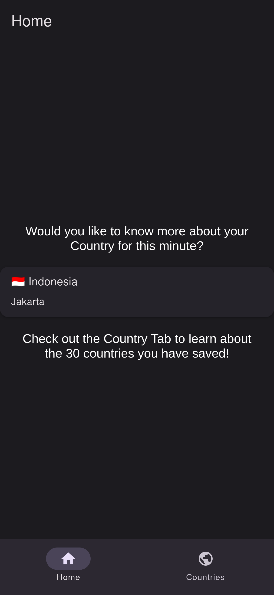
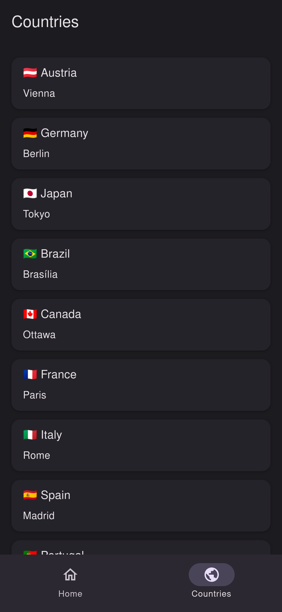
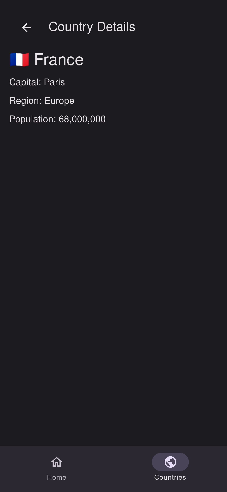

# MAD2_CountryDex
To you remember *PokeDex*... a programm to compare the stats of monsters, you trap in little balls and let out only to fight against other poor monsters?! \
This is the same thing but with countries and without the fighting😅. You can scroll through countries a see their statistics.
## Screenshots
This is how my app looks until now. The **Home** screen show a pseudo random country every minute to interest the user in using the app.
<table>
  <tr>
    <td></td>
    <td></td>
    <td></td>
  </tr>
</table>

## AI Usage
- `data.json` is AI generated
## Future Features
Later an [API](https://restcountries.com/) should be used to request the data.
## Learnings
### imports
- `@` is a pointer to a directory
- `export default` no `{ }` (`default` marks the main export in a file)
## Troubleshooting
- If the Browser only shows App-Manifest \
    -> Install `npx expo install react-dom react-native-web`